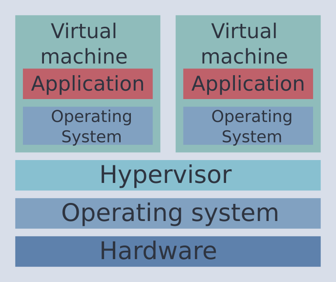

# Virtual machines

---

## What is a virtual machine?

- Environment that allows you to run any (supported) operating
- Virtual Machines are portable and flexible
- Strict separation from host operating system. (Popular for safety critical tasks: Desinfec't, Remote laptops)

---

## Common terms

- Host operating system (host OS)
    - The OS the hypervisor is installed on
- Guest operating system (guest OS)
    - The OS running inside the virtual machine
- Virtual machine (VM)
    - Environment the guest is running in

---

## Why is Virtualization Useful?

### For us

- Running multiple operating systems simultaneously
    - Test/develop software for other OS, debug problems on other OS...
- Easier software installations and testing
    - Offer preconfigured VM for users. Useful for trainings and teaching.
- Testing and disaster recovery
    - Create snapshots beforetesting. Copy VMs etc.

### Further benefits

- Infrastructure consolidation
    - Run many VMs on single host
- Seperate service from each other (security?!)

[VirtualBox Manual](https://www.virtualbox.org/manual/ch01.html)

---

## Types of Virtual Machines/ Hypervisors

- Sometimes distinction not clear, but in general:

### Type 1

- Runs directly on bare-metal hardware

### Type 2

- Requires a running OS

---

## Summary

- Allows to run additional OS on your machine
- VM is encapsulated